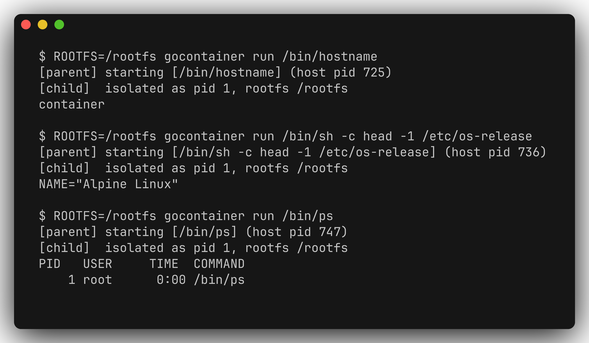

# gocontainer

[](https://github.com/thefcan/gocontainer/actions/workflows/ci.yml)


*A tiny **container runtime in ~80 lines of Go** — a learning re-implementation of
the core of `docker run`.*

It isolates a process with Linux **namespaces** (UTS, PID, mount), **chroots** into
a root filesystem and mounts a private **/proc**. Standard library only, zero
dependencies.

<p align="center">
  
  <br/>
  <em>Real output: the isolated process gets its own hostname, an Alpine root
  filesystem, and a PID namespace in which the workload itself is PID 1.</em>
</p>

## Why it's interesting
- Shows **how containers actually work** under the hood — not just how to *use* Docker.
- Hands-on with the Linux kernel primitives every container engine is built on:
  `clone(2)` namespace flags, `chroot`, `mount`, `sethostname`, `exec`.
- Clean parent/child re-exec pattern; pure standard library; cross-platform build —
  a stub keeps `go build` green off-Linux, and CI **builds and runs** the real
  runtime on Linux.

## What it isolates
| Isolation  | Mechanism                                     | Proof                                    |
|------------|-----------------------------------------------|------------------------------------------|
| Hostname   | new UTS namespace + `sethostname`             | `hostname` prints `container`            |
| Filesystem | `chroot` into an Alpine rootfs                | `/etc/os-release` shows Alpine, not host |
| Processes  | new PID namespace + private `/proc` + `exec`  | the workload runs as **PID 1**           |

## How it works
`gocontainer run <cmd>` re-executes itself (`/proc/self/exe`) as a `child` inside
fresh namespaces (via `SysProcAttr.Cloneflags`). The child sets the hostname,
chroots into `$ROOTFS`, mounts `/proc`, then **execs** the command — so the
workload replaces the init stub and becomes **PID 1**, exactly like a real
container. The workload's exit code is propagated back to the caller.

```
run (parent, on the host)          child (new UTS / PID / mount namespaces)
─────────────────────────          ────────────────────────────────────────
exec /proc/self/exe child ─clone─▶ sethostname("container")
                                   chroot($ROOTFS); chdir("/")
                                   mount -t proc proc /proc
                                   exec <cmd>            ← becomes PID 1
```

## Run it
Namespaces are a **Linux** feature, so on macOS/Windows run it inside a privileged
Linux container. With Docker:

```bash
# 1. grab a minimal root filesystem
docker export "$(docker create alpine:latest)" -o alpine-rootfs.tar

# 2. build and run gocontainer in a privileged Linux container
docker run --rm --privileged -v "$PWD":/src -w /src golang:1.26 sh -c '
  mkdir -p /rootfs && tar -xf alpine-rootfs.tar -C /rootfs
  go build -o /usr/local/bin/gocontainer .
  ROOTFS=/rootfs gocontainer run /bin/ps
'
```

On a Linux host you can build and run directly (as root):

```bash
go build -o gocontainer .
sudo ROOTFS=/path/to/rootfs ./gocontainer run /bin/sh
```

Expected output for `run /bin/ps` — the workload is PID 1 in its own namespace:

```
$ ROOTFS=/rootfs gocontainer run /bin/ps
[parent] starting [/bin/ps] (host pid 747)
[child]  isolated as pid 1, rootfs /rootfs
PID   USER     TIME  COMMAND
    1 root      0:00 /bin/ps
```

## Next steps
- cgroups (v2) for CPU / memory / pids limits
- `pivot_root` instead of `chroot` (a stronger filesystem boundary)
- user namespaces for rootless containers
- a network namespace with a veth pair

## License
[MIT](LICENSE) © 2026 Furkan Karafil
